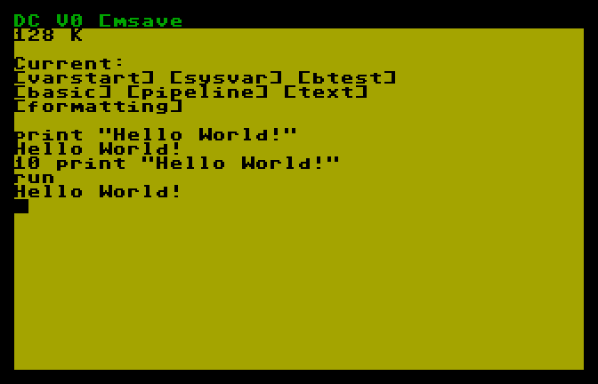
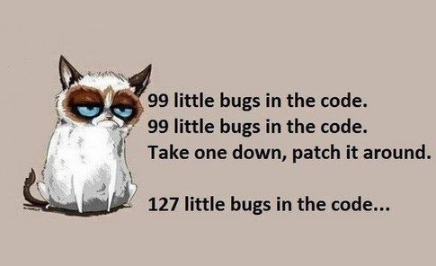
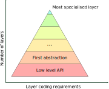

# API Layering
## Reducing complexity in large projects

I wrote my first video game when I was around 5. It was very simple, written in BASIC and just displayed
ASCII art on my toy laptop. At that time I knew I wanted to become a video game programmer because I loved
playing Wolfenstein 3D and Super Mario but I was constrained by the taste of others, not being financially
free to buy my own games, so I wanted to create my own, I wanted them to be not easily predictable so I
could entertain myself even if I was their creator - talk about life goals.

*picture from [oldmachinery.blogspot.com](https://oldmachinery.blogspot.com/2014/11/basic-interpreter.html).*

I kept improving and wrote many more games that would do the most desparate things until I decided,
despite my (still living) huge love for 2D RPGs, that I wanted to try something technically new.
I discovered 3D programming and OpenGL. It took me like a month to get started. I was around 14 and
felt strong with my experience in multiple programming languages, including C.

I had an empty window.
That window soon became a window with a black background, then a triangle would appear and after some
time, that triangle would start smoothly changing the colors at its vertices, gently transitioning between
every possible shade and combination of red, green and blue. The triangle became a triangle list, then
a strip and a fan. It became a square, a rectangle, then a cube, a rotating cube, a textured rotating
cube and finally a rotating textured cube, lit with the default GL lighting.

I started moving in my 3D
space and that felt amazing. It was like being in The Matrix. I could create whatever I wanted. I could
set my own rules, break free of my (every teenager's) strict world that just wanted me to study the boring
history and maths. Yes, I used hate maths but that's all another story.

The one cube became two, the two cubes became meshes loaded from files, then materials came,
animations and so forth. In no time I found myself 19, working on a 3D simulation for my high school
dissertation project. The teachers were impressed but moving from my own games, which evolved naturally
and chaotically to something with a more specific purpose was super hard. I realised making games was
terribly hard because there was too much complexity, too much going on and it felt very difficult to
modify stuff and introduce modifications into the existing features.

I began attending the university and quit making games. Too much was going on and too many new and
interesting fields awaited for me to discover and master them.

*picture from [programmersvalley.blogspot.com](http://programmersvalley.blogspot.com/2014/04/best-famous-programming-memes.html).*

I started working and was already familiar with source code management and using third party libraries,
things that in my past, when I started making 3D games, weren't just possible as I didn't have an internet
connection at home. But it felt pretty much like going back to that period because due to security policies I wasn't allowed to just browse the web and choose any library (even if
OSS) that would fit my needs and use it. Many things just had to be written from scratch every time or
inherited from the internal code base.

The trick to make sense of the whole bunch of code I needed to
write to go from point A to point B, where &#x201c;A&#x201d; was just the programming language's standard library and &#x201c;B&#x201d;
the finished product was to split the project into layers. As a software engineer I'm used to split my
work into modules to simplify reuse but there is more to that, something that they don't teach you at
the university because they assume you have access to libraries and you only have to write the final bit
of code to glue everything together to solve your real problem. This is layering.

Layering is not a different way to organise your code, not an alternative to modules or OOP. Layering is
a transversal project structure that works alongside whatever you do already and is most useful when
your project is big and requires a very high level problem to be solved with very low level facilities. If you have to write your own memory
management system, your collections, use very complex APIs and only then solve your problem, chances are
you'll benefit from layering. Let me give an example:

Speaking with some friends at work, it came out they were working on their own video game. One thing
led to another and I started talking about my experience with OpenGL. I had recently discovered Vulkan,
a low overhead API far more complex than OpenGL (seriously, it makes OGL look like a toy) and wanted
to try it out but was unsure because I didn't want to get back at making games. A couple of weeks later
I had bought and read books, downloaded and watched tutorials, installed the Vulkan SDK and started
playing with it. I was back at making games!

I recalled how hard it had been with OpenGL because I hadn't
access to libraries but I also knew that many game studios that work with their proprietary game
engines write everything from scratch because they have much more control, it's easier to adapt the different
algorithms and data structures to their own memory management system and they have comparable performance
across a plethora of devices and operating systems. So I went this way.

A year passed and I made several attempts at creating the simplest game engine with Vulkan, each
with a different architecture because everything has to work in harmony or you'll regret being born. Now
I finally reached a stable architecture, I realise what had been the problem of the games I wrote when I
was a kid and it just boils down to complexity. My complexity was damn high, shooting to the stars and
across the whole universe. So here is the first steps:

1. Write the test framework
2. Write the memory management system
3. Write the most common data structures
4. Write the parallelisation (multithreading, fibers, etc...) primitives
5. Add more data structures
6. Initialise the graphics driver

You will of course modularise your program, you'll probably create classes, organise them into namespaces
and organise these further into libraries if needed. Then the graphics come in and you'll have this
enormous Vulkan API at your disposal which requires *a lot* of configuration for every single thing you
do and so you will start creating wrappers. That's the way to go but the devil lies in the details so
at some point you'll start asking yourself &#x201c;am I doing this right?&#x201d;. It turns out you have three options
when deciding the granularity of your wrappers and only one of them is the correct one:

* Wrap as much as possible of the original wrapped API
* Wrap as little as possible of the original wrapped API
* Do something in between

When wrapping you'll want to create some layer that will contain all the lower level stuff, then eventually
create a layer based upon that and it will contain some more higher level stuff and you'll keep going until
you'll end up with something that abstracts all the details of the original API and you can use to solve
your problem. These abstractions will each narrow down the usage of the underlying API a bit, specialising
it a little more through each layer until it only does what you want it to do. Each layer introduces some
assumptions.

For example the Vulkan API can be used to write both a video game engine and a video player
but I'm not writing a video player so I know that when some configuration value can be made constant or
computed on these premises, I'll have one less to care about. Layering can effectively be depicted as
a layered pyramid. The lowest level is the raw API and the highest is your most specialised layer that
is only able to do whatever you need to do to solve your problem.

*graphical representation of raw API usage - picture from [usanetwork.com](https://www.usanetwork.com/wwe/episode-guide/episode-16-wwe-raw-recap-april-16-2018).*

The height of the pyramid will be the path you'll need to walk to go from the raw API to the solution of
your project and for a fixed problem/API pair you won't have control over it and it will be constant.
What you have control on, though, is the thickness of your layers. A maximally thick layer will allow you
to only have one layer that will go from bottom to top of your pyramid and will encompass all the code,
all the abstractions and all the complexity. A minimally thick layer will be a layer of thickness 0 and
to arrive from bottom to top you'll need to write an infinite amount of layers, so you'll never reach
a solution.

You can then understand that going through the &#x201c;Wrap as much as possible of the original wrapped API&#x201d;
philosophy will bring you towards a maximally thick, all-encompassing layer that will be a nightmare
to write, understand, maintain and enhance. On the other hand, its &#x201c;Wrap as little as possible of the
original wrapped API&#x201d; counterpart will bring you very close to the low level API you're trying to
specialise and it'll mean a lot more work to do to reach your goal and ultimately more complexity
and difficulty to understand its inner workings. Your goal as a software engineer is to find the
right thickness, the correct balance to get the most out of each layer without making it too complex.

You can use cyclomatic complexity to help you on that but it'll ultimately boil down to trial and error
at first and gut feelings - call it experience - as you get used to the process. I tend to follow my
instincts and if it feels wrong and complex it's probably wrong and complex. Same goes the other way
around: if it looks like you're just duplicating the original API, then you probably are. In both
cases just stop writing code, grab a coffee and review your progress. Don't be afraid to start from
scratch as you'll still waste much less time end effort than by progressing with bad layering.

Finally, layers will depend on each other but beware of the directions of these dependencies. The dependency should always go from a higher layer to a lower layer and that's because, of course, your higher layer will have to rely on the closest lower layer as a foundation for its own functionality. When a lower layer requires functionality from an higher level, you have a problem and will need to rework the
two layers that share this dependency. There is also the chance that a very high layer will need functionality of a very low level. Although this is not necessarily a problem, it may be a sign that some
functionality was not properly encoded in the layers in between.
